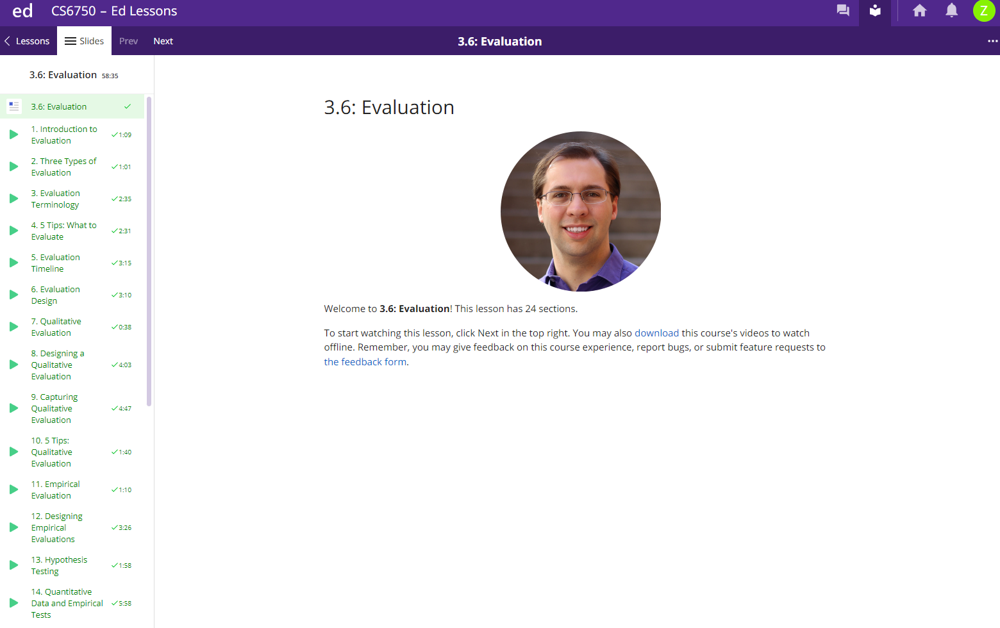

# EdLectureTimestamp
Shows timestamps on Ed lectures

### Without Extension


### With Extension




## How to Use

To use the Chrome Extension, follow these steps:

1. Clone the repository to your local machine:

   ```bash
   git clone https://github.com/zfoltz/EdLectureTimestamp.git
2. Open Google Chrome and navigate to `chrome://extensions/`.

3. Enable "Developer mode" in the top right corner of the extensions page.

4. Click on the "Load unpacked" button and select the extension directory (EdLectureTimestamp) from your local machine.

5. The extension icon Extension Icon should now appear in your Chrome toolbar.

6. Navigate to a lesson page in Ed Lessons, and it will show the timestamps. You may have to reload the page again if the timestamps don't show up initially.